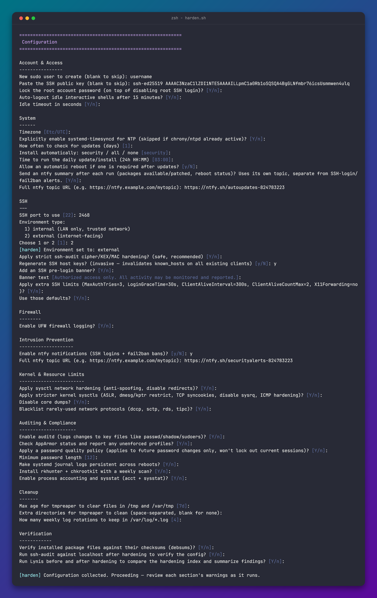
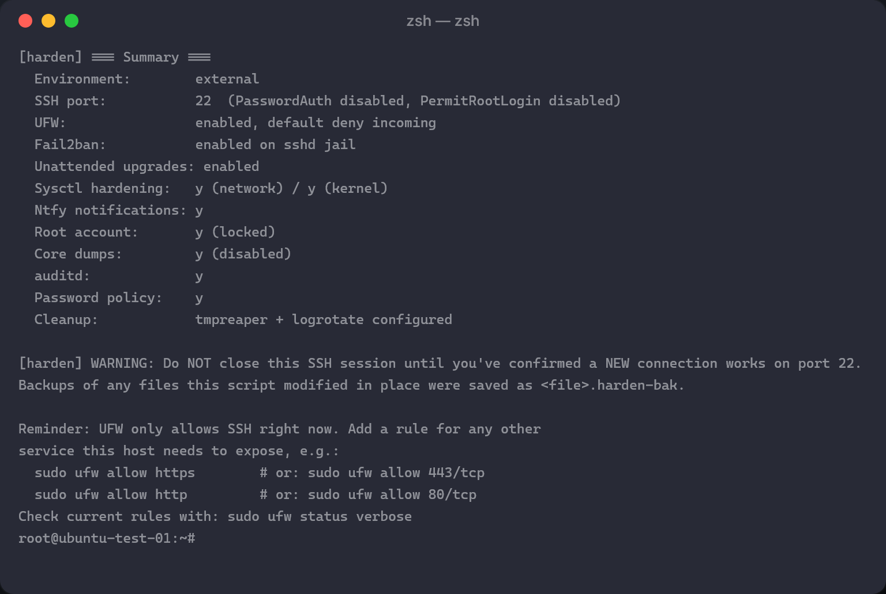

# harden.sh

Interactive hardening and auto-cleanup setup for Debian-based systems
(Debian, Ubuntu, Raspberry Pi OS). Asks a handful of questions up front,
then applies everything unattended. Output is colour-coded and organized
into sections when run in a terminal that supports it (plain text
otherwise — see [Design notes](#design-notes)).

## Screenshots

**Configuration prompts:**



**Summary output:**



## What it does

- Updates system packages, installs `curl` as a base dependency
- Creates a sudo user and/or installs an SSH public key
- Audits sudo access: requires a password anywhere `NOPASSWD` is granted
  (not just the Raspberry Pi OS default), and sets a password for any
  sudo-group account that's locked or has none
- Sets the timezone
- Configures `unattended-upgrades`: check interval, update level
  (security-only / all / none), a fixed daily install time (default
  03:00, via a systemd timer override rather than the default randomized
  window), optional automatic reboot with its own scheduled time, and an
  optional ntfy summary after each run (packages patched, still
  upgradable, reboot-required) — on its own topic, separate from the
  SSH-login/fail2ban alerts
- Hardens SSH via a drop-in config (`/etc/ssh/sshd_config.d/99-harden.conf`):
  custom port, no root login, no password auth, optional strict
  cipher/KEX/MAC set, optional host key regeneration
- Configures UFW: default deny incoming, rate-limited SSH (by LAN CIDR for
  internal boxes, by port for internet-facing ones)
- Configures fail2ban's sshd jail (short ban + optional ntfy alert for
  internal, long ban for external), with an optional `ntfy` notification
  on login and on ban
- Applies sysctl network hardening (anti-spoofing, disable redirects) — optional
- Applies stricter kernel sysctls (ASLR, dmesg/kptr restrict, TCP syncookies) — optional
- Locks the root account password, on top of disabling root SSH login — optional
- Adds an SSH pre-login banner — optional
- Disables core dumps (limits.d + `fs.suid_dumpable`) — optional
- Enables `auditd` with watch rules on passwd/shadow/sudoers/sshd_config — optional
- Checks AppArmor status and reports it (doesn't force changes) — optional
- Applies a password quality/expiry policy — future password changes and new accounts only, never retroactive
- Makes systemd journal logs persistent across reboots, capped at 500M / 1 month
- Enables UFW logging
- Adds extra SSH limits (`MaxAuthTries`, `LoginGraceTime`, `ClientAliveInterval`, no X11 forwarding)
- Sets explicit SSH safe-defaults (`PermitEmptyPasswords no`, `IgnoreRhosts yes`) unconditionally
- Extends the SSH banner to `/etc/issue` and `/etc/motd`, not just the SSH pre-login prompt
- Auto-logs-out idle interactive shells (`TMOUT`) — optional
- Explicitly enables `systemd-timesyncd` for NTP, skipped if chrony/ntpd is already active — optional
- Blacklists rarely-used network protocols (dccp, sctp, rds, tipc) from auto-loading — optional
- Enables process accounting and `sysstat` — optional
- Installs `rkhunter` + `chkrootkit` with a weekly scan (Sundays 04:00) that
  only alerts via ntfy when it finds something — reuses the SSH-login/fail2ban topic
- Verifies installed package files against their checksums with `debsums`
- Runs `ssh-audit` against localhost afterwards to confirm the cipher config took
- Offers to run Lynis both before and after hardening to compare the
  hardening index, and summarizes the (very verbose) raw report into a
  capped list of warnings/suggestions instead of dumping it in full
- Sets up `tmpreaper` and `logrotate` for automatic cleanup, including the
  UFW, rootkit-scan, unattended-upgrades and Lynis logs so they can't fill the disk

## Requirements

- Debian-based OS
- Run as root

## Usage

```bash
sudo bash harden.sh
```

To see exactly what would change without touching anything:

```bash
sudo bash harden.sh --dry-run
```

Dry-run asks all the same questions and reports every file write, package
install and command it would run, then exits without making changes.

Answer the prompts as they appear. At the end it restarts SSH — **test a
new connection on the new port before closing your current session.**

### Run directly from GitHub or a self-hosted server

```bash
sudo bash -c "$(curl -fsSL https://raw.githubusercontent.com/<user>/<repo>/main/harden.sh)"
# or
sudo bash -c "$(wget -qO- https://your-server.example.com/harden.sh)"
```

Use this form, **not** `curl ... | sudo bash`. When a pipe feeds `sudo`
directly, sudo's `use_pty` setting (the Ubuntu/Debian default) allocates a
new pty for the child process and wires its input from sudo's *own* stdin
— which in that case is the same pipe carrying the script. Once curl
finishes sending the script text, that channel closes, and there's no
path left for your keystrokes to reach the prompts at all: it hangs
waiting on input that can never arrive, and even Ctrl+C may not reach it.
Running `curl` inside a command substitution instead means it fully
completes and closes before `sudo bash -c` ever starts, so sudo's stdin
stays your real terminal throughout.

**Warning:** piping a script straight to `bash` runs it with zero chance to
inspect it first, and gives whoever controls that URL (or anyone who can
tamper with it in transit — compromised server, DNS hijack, MITM on a
non-HTTPS link) full root on your box the moment you run the command.
Only do this over HTTPS, only from a source you trust, and ideally pin to
a specific commit/tag rather than `main` so the content can't change
under you between when you read it and when you run it:

```bash
sudo bash -c "$(curl -fsSL https://raw.githubusercontent.com/<user>/<repo>/<commit-sha>/harden.sh)"
```

The safer default is still to download it, read it, then run it:

```bash
curl -fsSL https://raw.githubusercontent.com/<user>/<repo>/main/harden.sh -o harden.sh
less harden.sh
sudo bash harden.sh
```

## Rolling back

`harden-undo.sh` reverses changes selectively. It checks what's actually
present and only asks about things it finds, so it's safe to run even if
you only did a partial hardening run:

```bash
sudo bash harden-undo.sh
```

It restores from the `.harden-bak` backups where they exist, and removes
files/config `harden.sh` created otherwise. Prompts for the handful of
reverts that meaningfully weaken security — disabling UFW or fail2ban,
re-enabling SSH password/root login, unlocking the root account, or
restoring passwordless sudo — are shown in red to distinguish them from
routine cleanup. Not everything is offered — things with no meaningful
"undo" (timezone, the AppArmor status check, which makes no changes)
aren't included, and creating a user account isn't reversible through
this script (deleting an account risks deleting its home directory) —
remove one manually with `userdel` if needed.

## Design notes

- SSH changes go in a drop-in file, not edited into `sshd_config` directly.
  `sshd -t` validates the config before any restart; if validation fails,
  the drop-in is removed and the existing session is left untouched.
- On Ubuntu 22.10+ (including 24.04 LTS), SSH is socket-activated:
  `ssh.socket` owns the actual listening port, and restarting
  `ssh.service` alone does **not** move it — only `systemctl daemon-reload`
  followed by `systemctl restart ssh.socket` does. The script detects
  socket activation and does both; on systems without it (Debian,
  Raspberry Pi OS, older Ubuntu) this is skipped entirely. It also checks
  with `ss -ltn` afterward that something is actually listening on the
  configured port before declaring success.
- The SSH drop-in sets `AddressFamily inet` (IPv4 only), so the
  post-hardening `ssh-audit` verification connects to `127.0.0.1`
  explicitly rather than `localhost` — on Ubuntu, `localhost` commonly
  resolves to `::1` first, which would otherwise get refused before ever
  trying the IPv4 address that actually works.
- UFW's own rate-limiting (`ufw limit`) is used instead of raw iptables
  rules, to avoid two firewall layers fighting each other.
- fail2ban gets a minimal `jail.local` (it merges over `jail.conf`
  automatically) rather than a full copy of the stock config.
- Every `apt install` is wrapped so one missing/failed package logs a
  warning and the rest of the run continues.
- The password policy only touches `pwquality.conf` and the default aging
  fields in `login.defs` — it applies to future password changes and new
  accounts, never retroactively, so it can't expire or lock out your
  current session.
- Safe to re-run: config files are fully rewritten (not appended to) each
  run, package/user/PAM-line checks skip what's already there, and UFW
  drops its previously-added SSH rule before adding the current one — so
  changing your answers (e.g. a different SSH port) on a second run
  doesn't leave stale config or open ports behind. Host key backups are
  only seeded once, so re-running with host key regeneration enabled
  won't overwrite the true original keys with an already-regenerated set.
- Colour and the section dividers auto-disable when output isn't a
  terminal, `NO_COLOR` is set, or `tput` isn't available — falling back
  to plain, uncoloured text rather than raw escape codes. The dividers
  and markers use plain ASCII (`=`, `[OK]`) rather than Unicode
  box-drawing or symbol characters, since those can render as garbled
  text on terminals/locales that don't handle multi-byte UTF-8 cleanly.
- The Configuration phase groups its prompts under lightweight `-----`
  subheadings (Account & Access, System, SSH, Firewall, Intrusion
  Prevention, Kernel & Resource Limits, Auditing & Compliance, Cleanup,
  Verification) that match the full-width section dividers those answers
  get applied under later in the run — so it's clear upfront which
  question feeds into which part of the actual hardening.

## Warnings

- Host key regeneration invalidates `known_hosts` on every existing client.
- Password SSH auth is disabled — make sure your key is installed and
  working before you close your session.

## Troubleshooting

**ntfy notifications don't arrive:**
- Confirm `curl` is installed (`which curl`).
- Test the hook directly — note `sudo VAR=x cmd` strips prefixed env vars
  (`env_reset`), so use `env` instead:
  ```bash
  env PAM_TYPE=open_session PAM_USER=test HOSTNAME=$(hostname) PAM_RHOST=1.2.3.4 \
    bash -x /usr/bin/ntfy-ssh-login.sh
  ```
- Check `grep pam_exec /etc/pam.d/sshd` and `sshd -T | grep -i usepam`.
- If your ntfy server sits behind Cloudflare (or similar), check for
  country/IP restrictions on the zone — they can block the request
  silently with no error in `auth.log`.
